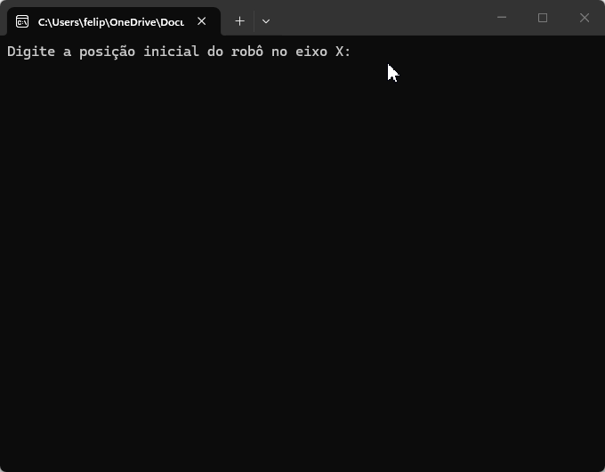

# Robô Tupiniquim



## Projeto

Desenvolvido durante o curso Back-End da [Academia do Programador](https://www.academiadoprogramador.net)

## Introdução

Especificação
A Agência Espacial Brasileira (AEB) contratou a Academia do Programador para
desenvolver o software de guia do Robô Tupiniquim I, que fará análises em Marte. O robô
explorará uma área retangular dividida em um grid.

Sobre o Sistema

- Posição e Orientação: A posição do robô é dada por coordenadas (X, Y) e uma
  letra que representa a direção para onde ele está olhando (Norte, Sul, Leste, Oeste).
- Comandos: A AEB envia strings de comando simples (E, D, M):

1. E (Esquerda) e D (Direita) fazem o robô virar 90 graus, sem sair do lugar.
2. M (Mover) move o robô uma posição no grid para frente, mantendo a direção.

## Como utilizar

1. Clone o repositório ou baixe o código fonte.
2. Abra o terminal ou o prompt de comando e navegue até a pasta raiz
3. Utilize o comando abaixo para restaurar as dependências do projeto.

   ```
   dotnet restore
   ```

4. Para executar o projeto compilando em tempo real

   ```
   dotnet run --project RoboTupiniquim.ConsoleApp
   ```

## Requisitos

- .NET 10.0 SDK